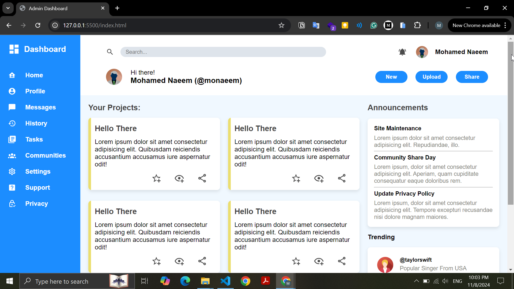

# Project Dashboard

This project is a responsive and visually appealing dashboard layout created using HTML and CSS. The dashboard uses CSS Grid and Flexbox to achieve a flexible structure, offering a clean and organized layout for various elements.

## Live Demo

You can view the live version of this project here: [Live Demo](https://mohamednaeemm.github.io/admin-dashboard/)

 

## Features

- **Responsive Design:** Adapts to various screen sizes.
- **Sidebar and Header:** Grid layout with sidebar and header positioning.
- **Cards and Columns:** Organized layout for displaying information in columns.
- **Custom Styling:** Uses Flexbox and Grid for a modern and user-friendly interface.

## Technologies Used

- **HTML**
- **CSS** 
  - CSS Grid 
  - Flexbox

